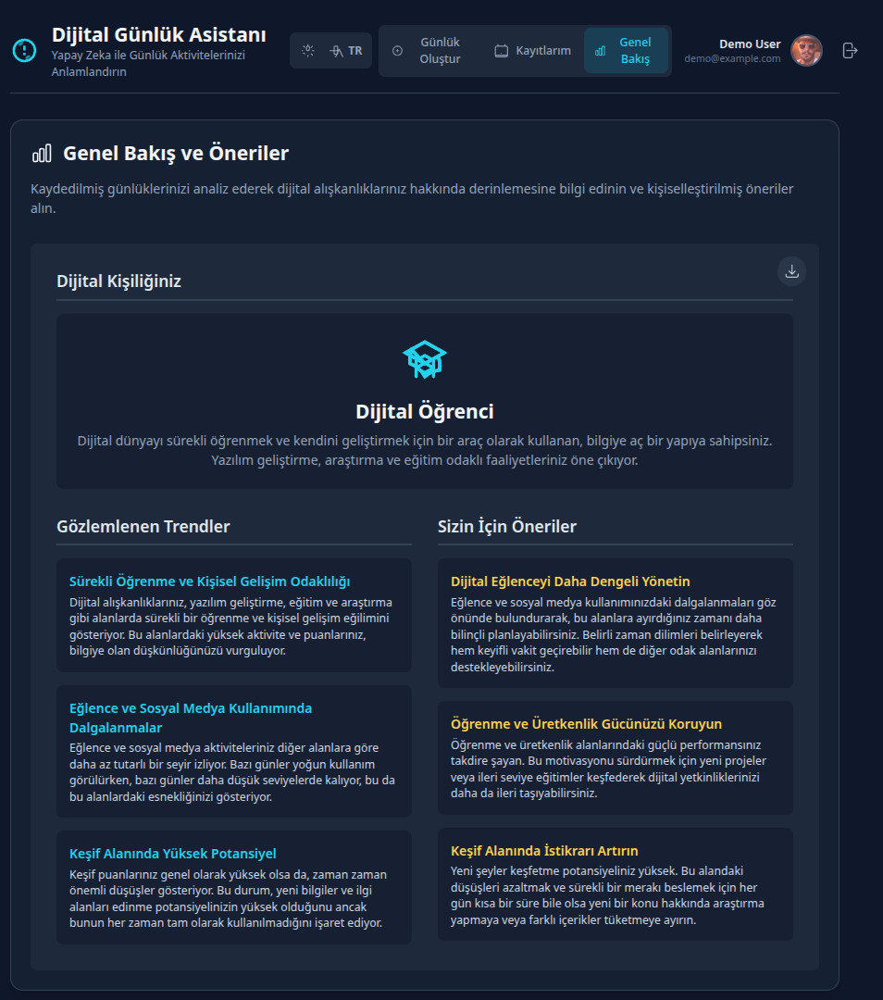
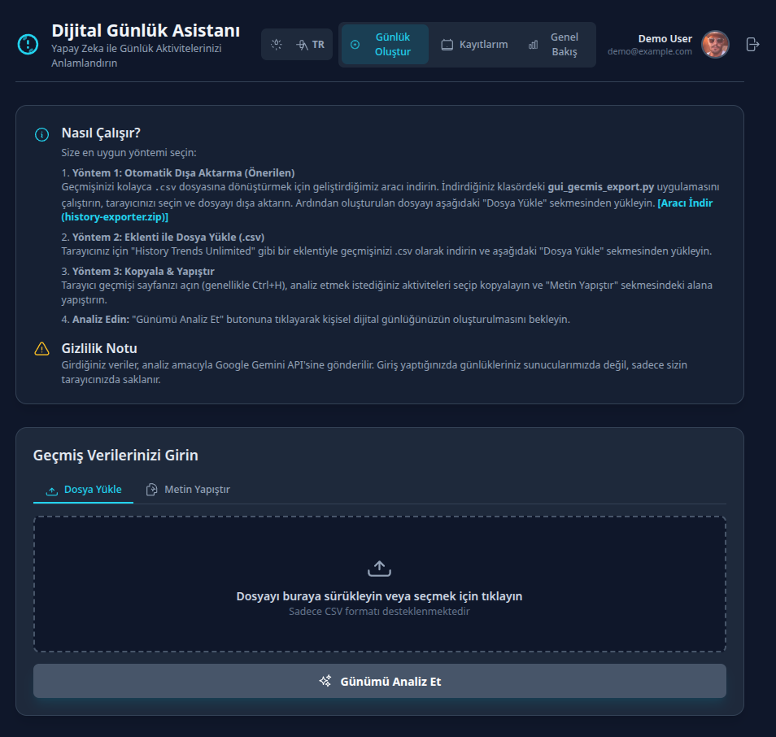

# Dijital Günlük Asistanı

**Canlı Uygulama:** [**https://dijital-g-nl-k-asistan-667567124631.us-west1.run.app/**](https://dijital-g-nl-k-asistan-667567124631.us-west1.run.app/)

Yapay zeka destekli bu uygulama, tarayıcı geçmişinizi analiz ederek günlük dijital aktivitelerinizden anlamlı ve kişisel bir günlük oluşturur.

## ✨ Ekran Görüntüleri

| Genel Bakış & Öneriler | Günlük Analiz | Kayıtlarım (Takvim) | Nasıl Çalışır? |
| :---: | :---: | :---: | :---: |
|  |  |  |  |


## 🚀 Temel Özellikler

- **Tarayıcı Geçmişi Analizi**: `.csv` dosyası veya kopyala-yapıştır metin ile tarayıcı geçmişinizi kolayca yükleyin. Proje, tarayıcı geçmişini dışa aktarmak için kullanışlı bir Python aracı içerir.
- **Yapay Zeka Destekli Özet**: Google Gemini veya OpenRouter (Claude, Llama vb.) modelleri ile verilerinizi analiz ederek gününüzü zaman akışına (sabah, öğlen, akşam) göre özetler.
- **Detaylı Raporlama**:
  - Günün önemli anları ve ikonlarla zenginleştirilmiş aktiviteler.
  - Aktivite kategorilerine göre dağılım grafiği.
  - Üretkenlik, Öğrenme, Keşif ve Eğlence alanlarında 5 üzerinden puanlama ve geri bildirimler.
- **Veri Yönetimi**: Oluşturduğunuz günlükleri tek tuşla tarayıcınızın yerel depolamasına kaydedin (Mevcut sürümde Google entegrasyonu demo amaçlıdır).
- **Takvim Görünümü (Heatmap)**: Kaydettiğiniz tüm günlükleri bir takvim üzerinde görüntüleyin. Günlerin aktivite yoğunluğuna göre renklendirildiği bu heatmap ile dijital alışkanlıklarınızı bir bakışta görün.
- **Genel Bakış ve Öneriler**: Tüm günlükleriniz üzerinden yapılan genel bir analizle dijital kişiliğinizi, alışkanlık trendlerinizi ve kişiselleştirilmiş önerileri keşfedin.
- **Kişiselleştirme & Paylaşım**:
  - Göz zevkinize göre Açık ve Koyu tema arasında geçiş yapın.
  - Uygulamayı Türkçe ve İngilizce dillerinde kullanın.
  - Oluşturulan günlüğü PNG olarak indirin, metin olarak kopyalayın veya sosyal medyada paylaşın.


## 🛠️ Nasıl Çalışır?

1.  **Veri Girişi**: "Günlük Oluştur" sekmesinde, tarayıcı geçmişinizi `.csv` dosyası olarak yükleyin veya doğrudan metin alanına yapıştırın.
2.  **Analiz**: "Günümü Analiz Et" butonuna tıklayın. Yapay zeka verilerinizi işlerken kısa bir süre bekleyin.
3.  **Sonuç**: Kişisel dijital günlüğünüz hazır! Detaylı raporu inceleyin.
4.  **Kaydet ve Görüntüle**:
    - "Kaydet" butonu ile günlüğünüzü ileride erişmek üzere kaydedin.
    - "Kayıtlarım" sekmesinden geçmiş günlüklerinizi takvim üzerinde görün.
5.  **Genel Analiz**: Yeterli veri biriktirdiğinizde, "Genel Bakış" sekmesine giderek dijital alışkanlıklarınız hakkında derinlemesine bilgi ve öneriler alın.

## 💻 Kullanılan Teknolojiler

- **Frontend**: React, TypeScript, Tailwind CSS
- **AI**: Google Gemini API / OpenRouter (100+ model desteği)
- **Grafikler**: Recharts
- **Yardımcı Kütüphaneler**: html-to-image

## 🤖 AI Provider Yapılandırması

Uygulama, birden fazla AI sağlayıcısını destekler. `.env` dosyasında `AI_PROVIDER` değişkenini ayarlayarak geçiş yapabilirsiniz:

```bash
# Google Gemini (varsayılan)
AI_PROVIDER=gemini
GEMINI_API_KEY=your_key_here

# OpenRouter (Claude, Llama, Mistral vb.)
AI_PROVIDER=openrouter
OPENROUTER_API_KEY=your_key_here
OPENROUTER_MODEL=google/gemini-2.5-flash  # veya anthropic/claude-3.5-sonnet vb.
```

Daha fazla bilgi için `.env.example` dosyasına bakın.

## 🔮 Gelecek Planları

Projenin bir sonraki aşamasında, kullanıcı deneyimini daha da ileriye taşımak için aşağıdaki entegrasyonlar hedeflenmektedir:
- **Gerçek Google Entegrasyonu**: Demo giriş sistemi yerine, kullanıcıların kendi Google hesaplarıyla güvenli bir şekilde giriş yapabilmesi.
- **Google Drive Yedekleme**: Oluşturulan günlüklerin, kullanıcının isteği doğrultusunda kendi Google Drive hesabına şifrelenmiş bir şekilde yedeklenmesi.

## 🧑‍💻 Geliştirici & İletişim

Bu proje [Cenk Tekin](https://github.com/cenktekin) tarafından geliştirilmiştir.

- **GitHub Repo**: [cenktekin/digital-diary](https://github.com/cenktekin/digital-diary)
- **İletişim**: `cenktekin@duck.com`

## 🔒 Gizlilik

Gizliliğiniz bizim için önemlidir. Girdiğiniz veriler, analiz amacıyla seçtiğiniz AI sağlayıcısına (Google Gemini veya OpenRouter) gönderilir. Verileriniz sunucularımızda **saklanmaz**, sadece sizin tarayıcınızın yerel depolama alanında tutulur.
